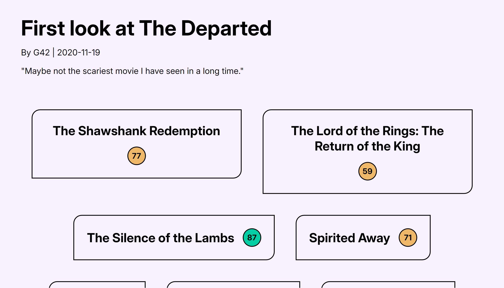

# The Reel Deal 🎬

A website where users can browse detailed movie reviews and see movie ratings.

## Deployment 🚀

https://the-reel-deal.vercel.app/

## Features

- User authentication to be able to access review and film data
- Access critic reviews including scores for different films
- Access films including a normalized score and trending score calculated based on critic reviews
- Reviews and films have a "related" section displaying reviews that cover the same films/films that have the same categories

## Related

- [The Reel Deal Backend](https://github.com/louisdoan9/TheReelDealBackend)

## Screenshots 📸

